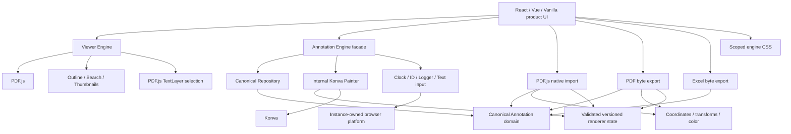

# Architecture

InkLayer Core is a framework-independent PDF viewer and annotation engine. The
canonical `Annotation` collection in one `AnnotationRepository` is the only
application data source. Konva is the exact renderer, while React, Vue, and
Vanilla consumers call the same facade and own only product UI composition.

## Dependency rules

- `domain` has no DOM, PDF.js, or Konva dependency.
- `geometry` depends only on domain-neutral coordinate/value types.
- `repository` depends only on domain.
- `renderer/konva` depends on domain, geometry, and Konva.
- `viewer` owns PDF.js loading, range, worker configuration, page features,
  TextLayer selection, and lifecycle.
- `annotation` composes repository, renderer, ports, and browser defaults.
- `import/pdfjs` and exporters are secondary entries; heavy export libraries do
  not enter Viewer or Annotation entry bundles.
- `platform/browser` implements ports and performs browser actions only when a
  function is invoked.
- `compat/legacy` is the only module that understands historical storage fields.

`npm run check:dependencies` resolves all local TypeScript imports, rejects
cycles and forbidden layer edges, and rejects framework packages. The current
graph covers 48 production implementation files with no cycles.

## Ownership and lifecycle

Each Viewer owns its loading task, document generation, range transport,
optional web viewer, worker lease, outline/search work, thumbnail surfaces and
URLs, TextLayers, and listeners. Each Annotation Engine owns or
borrows one repository explicitly and owns its stages, layers, transformer,
images, labels, page registry, pointer gestures, temporary text inputs, event
subscriptions, and root metadata. `destroy()` is idempotent and never cleans a
different instance's resources.

Painter classes and Konva nodes are internal. Public events carry detached
canonical data, not renderer nodes, mutable maps, or PDF.js private fields.

The framework boundary is behavioral rather than visual. React/Vue render the
thumbnail tree, search field/results, contextual menus, and toolbars; Core owns
the extraction, matching, page-space normalization, and direct document
manipulation behind those controls. See `docs/core-boundary.md`.
