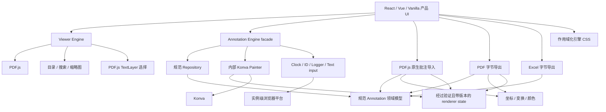

# 架构

InkLayer Core 是与框架无关的 PDF Viewer 与批注引擎。单个 `AnnotationRepository` 中的规范 `Annotation` 集合是唯一应用数据源。Konva 是确定的渲染器，React、Vue 和 Vanilla 使用方调用同一个 facade，只负责产品 UI 组合。

## 依赖规则

- `domain` 不依赖 DOM、PDF.js 或 Konva。
- `geometry` 只依赖与领域无关的坐标/值类型。
- `repository` 只依赖 domain。
- `renderer/konva` 依赖 domain、geometry 和 Konva。
- `viewer` 负责 PDF.js 加载、Range、Worker 配置、页面功能、TextLayer 选择和生命周期。
- `annotation` 组合 repository、renderer、port 和浏览器默认实现。
- `import/pdfjs` 与 exporter 是次级入口；重量级导出库不会进入 Viewer 或 Annotation 入口 bundle。
- `platform/browser` 实现 port，且只在函数实际调用时执行浏览器行为。

`npm run check:dependencies` 会解析全部本地 TypeScript import，拒绝循环依赖、禁止的分层依赖边和框架包。

## 所有权与生命周期

每个 Viewer 拥有自己的 loading task、document generation、range transport、可选 web viewer、worker lease、outline/search 工作、thumbnail surface 与 URL、TextLayer 和监听器。每个 Annotation Engine 显式拥有或借用一个 Repository，并拥有自己的 Stage、Layer、Transformer、图片、标签、页面 Registry、指针手势、临时文字输入、事件订阅和 root 元数据。`destroy()` 是幂等的，且绝不会清理其他实例的资源。

Painter 类和 Konva 节点属于内部实现。公共事件携带分离的规范数据，不携带 renderer 节点、可变 Map 或 PDF.js 私有字段。

框架边界按行为而不是视觉划分。React/Vue 渲染缩略图树、搜索框/结果、上下文菜单和工具栏；Core 负责这些控件背后的提取、匹配、页面空间归一化和直接文档操作。详见 [Core 产品边界](./core-boundary.md)。
